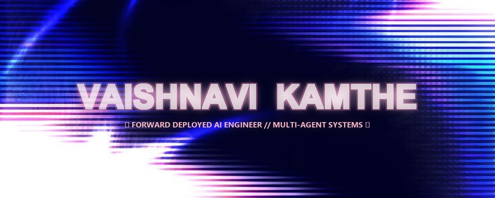
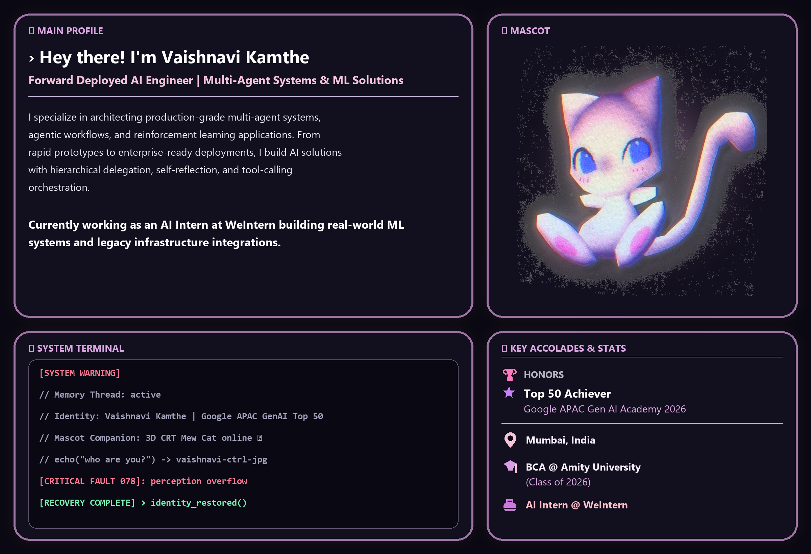
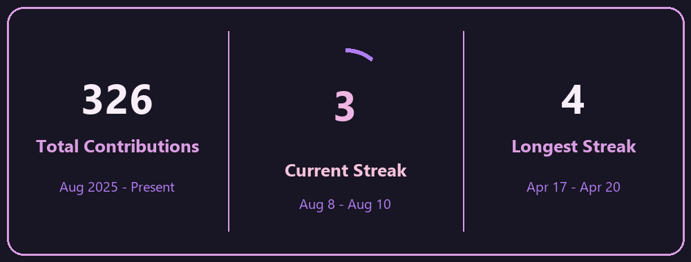

  <!-- TOP HEADER BANNER (OPTION 8 NEON TUBE GAS SIGN BANNER) -->
  

    

  <!-- NAVIGATION BUTTONS / BADGES (HOLOGRAM 2 OPTION 6 IRIDESCENT PASTEL LUXE) -->
  
  &nbsp;
  
  &nbsp;
  
  &nbsp;
  

 

<!-- MAIN PROFILE HERO BENTO GRID (ULTRA-HIGH-DPI GLOWING GLASSMORPHISM CARDS) -->

<!-- SMOOTH GLOW WAVE DIVIDER -->

 

##  **Featured AI & Production Systems**

<table>
  <tr>
    <td width="50%" valign="top">
      <h3> <a href="https://github.com/vaishnavi-ctrl-jpg/hackathon-multiagent-assistant">Multi-Agent Productivity System</a></h3>
      
Production-grade multi-agent platform with hierarchical delegation, real-time API orchestration, state optimization, and MCP integration.

      <b>Tech:</b> Python, FastAPI, Gemini 2.0 Flash, ADK, MCP, Render
    </td>
    <td width="50%" valign="top">
      <h3> <a href="https://github.com/vaishnavi-ctrl-jpg/FLUXARENA">FluxArena</a></h3>
      
Enterprise stadium intelligence platform orchestrating 100+ autonomous agents for real-time crowd decision-making and sub-second density inference.

      <b>Tech:</b> Next.js 14, React, Firebase, Gemini 2.5 Flash API, GCP
    </td>
  </tr>
  <tr>
    <td width="50%" valign="top">
      <h3> <a href="https://github.com/vaishnavi-ctrl-jpg/MEDSENSE-AI">MedSense AI</a></h3>
      
Emergency response decision agent using reinforcement learning (DQN, PPO) and POMDP-based state management with human-in-the-loop feedback.

      <b>Tech:</b> PyTorch, Gymnasium, OpenAI Gym, POMDP, Reinforcement Learning
    </td>
    <td width="50%" valign="top">
      <h3> <a href="https://github.com/vaishnavi-ctrl-jpg/SIGNAL-X">Signal:X</a></h3>
      
Intelligent traffic management system combining YOLOv8 object detection with self-reflecting multi-agent adaptive control (30% wait-time reduction).

      <b>Tech:</b> Python, YOLOv8, Deep Learning, Real-Time Data Pipelines
    </td>
  </tr>
</table>

 

<!-- SMOOTH GLOW WAVE DIVIDER -->

 

##  **Technical Skills & Stack**

  <!-- LANGUAGES (HOLOGRAM 2 OPTION 2 DARK CYBER SLATE) -->
  
  &nbsp;
  
  &nbsp;
  
  &nbsp;
  
  &nbsp;
  

    

  <!-- AI & ML FRAMEWORKS -->
  
  &nbsp;
  
  &nbsp;
  
  &nbsp;
  
  &nbsp;
  

    

  <!-- AI APIS & CLOUD -->
  
  &nbsp;
  
  &nbsp;
  
  &nbsp;
  
  &nbsp;
  

 

<!-- SMOOTH GLOW WAVE DIVIDER -->

 

##  **GitHub Analytics & Streak Stats**

<!-- HIGH-DPI ANIMATED GIF STREAK STATS CARD (GUARANTEED 100% GITHUB MARKDOWN LOADING) -->

  

 

<table width="100%">
  <tr>
    <td width="55%" align="center" valign="middle">
      <!-- RELIABLE SELF-HOSTED FAST-LOADING STATS CARD -->
      
    </td>
    <td width="45%" align="center" valign="middle">
      
    </td>
  </tr>
</table>

 

<!-- SMOOTH GLOW WAVE DIVIDER -->

 

   &nbsp; <b>Designed &amp; built by Vaishnavi Kamthe</b> (<a href="https://github.com/vaishnavi-ctrl-jpg"><b>vaishnavi-ctrl-jpg</b></a>) &nbsp; 

